# 🛍️ S-Store — Modern E-Commerce Flutter Application

[](https://flutter.dev)
[](https://dart.dev)
[](https://supabase.com)
[](https://pub.dev/packages/get)
[](#project-architecture)
[](LICENSE)

**S-Store** is a state-of-the-art, feature-rich mobile e-commerce application crafted using **Flutter** and backed by **Supabase**. Built following clean architecture, reactive state management with **GetX**, and a modern visual design system adhering to 8-point grid typography, sleek glassmorphism, and responsive layouts.

---

## 📱 App Showcase & Visual Gallery

### 1. Onboarding & Authentication Flow
| Splash Screen | Onboarding: Discover | Onboarding: Payment | Onboarding: Delivery |
| :---: | :---: | :---: | :---: |
| 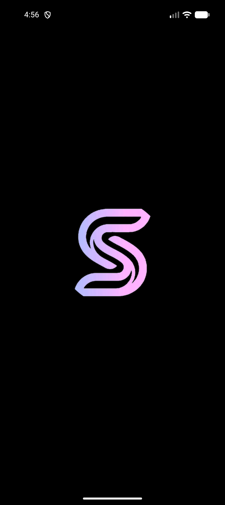 | 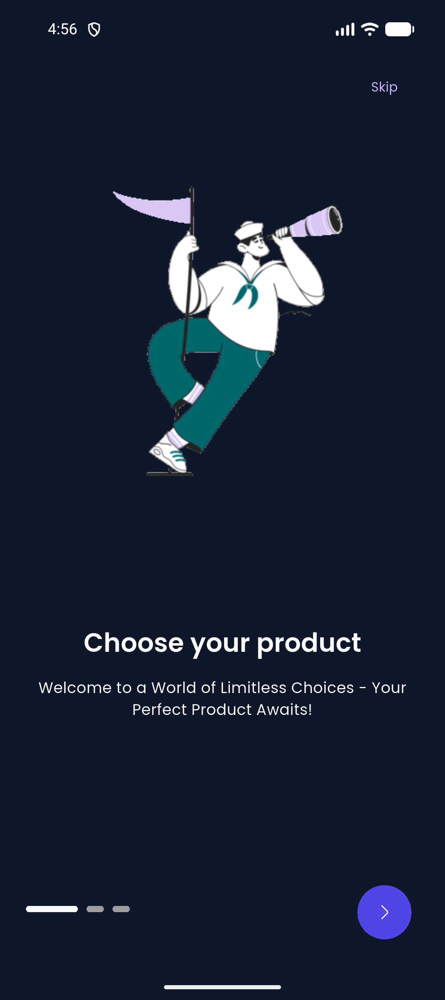 | 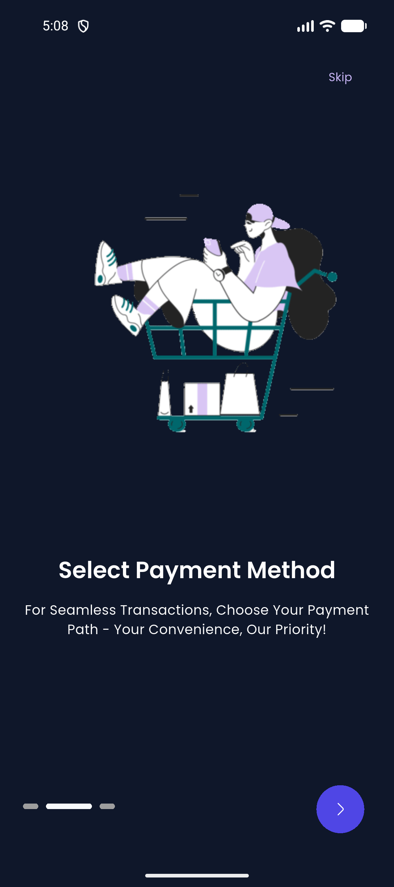 | 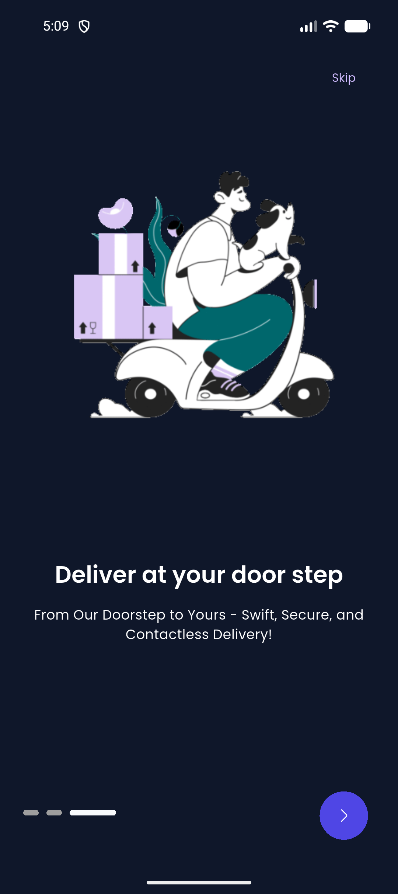 |

| Sign In (Glassmorphic) | Create Account | Forgot Password |
| :---: | :---: | :---: |
| 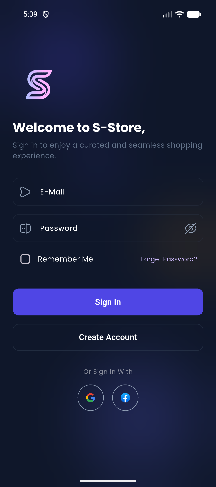 | 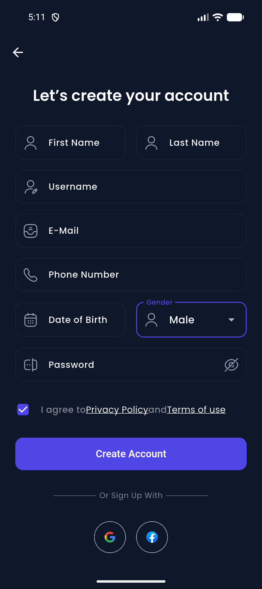 | 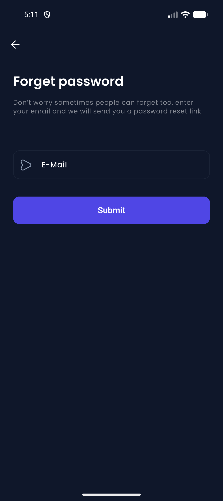 |

---

### 2. Browsing & Discovery
| Home Screen | Store: Featured Brands | Store: Products Grid | Sports Subcategories |
| :---: | :---: | :---: | :---: |
| 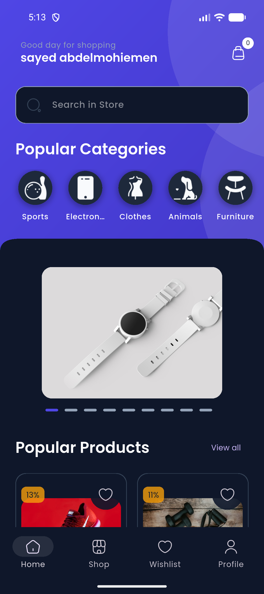 | 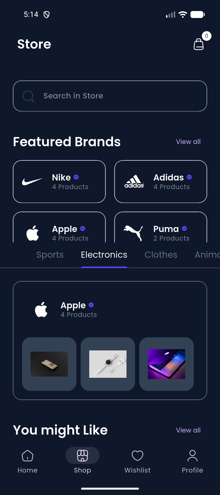 | 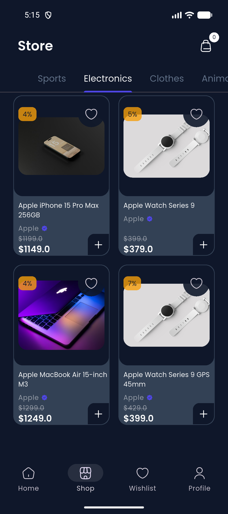 | 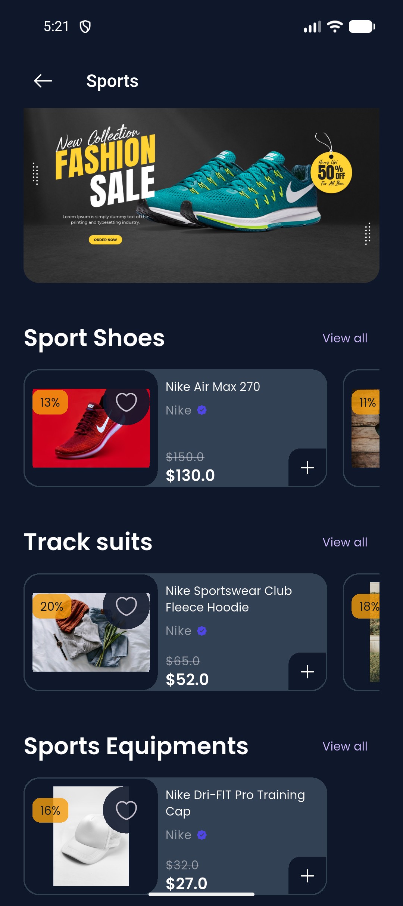 |

---

### 3. Shopping, Search & Checkout
| Search Store | Product Details | Wishlist / Favorites | Order Review & Checkout | Payment Success |
| :---: | :---: | :---: | :---: | :---: |
| 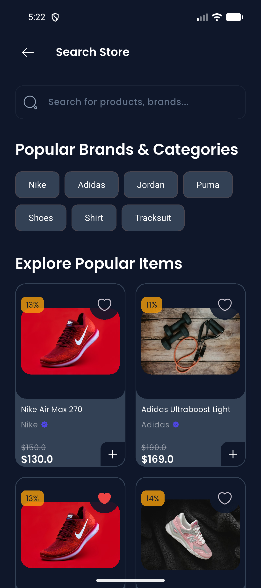 | 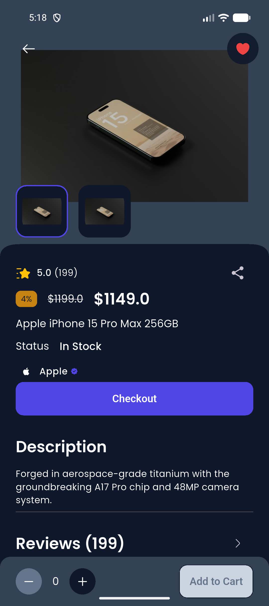 | 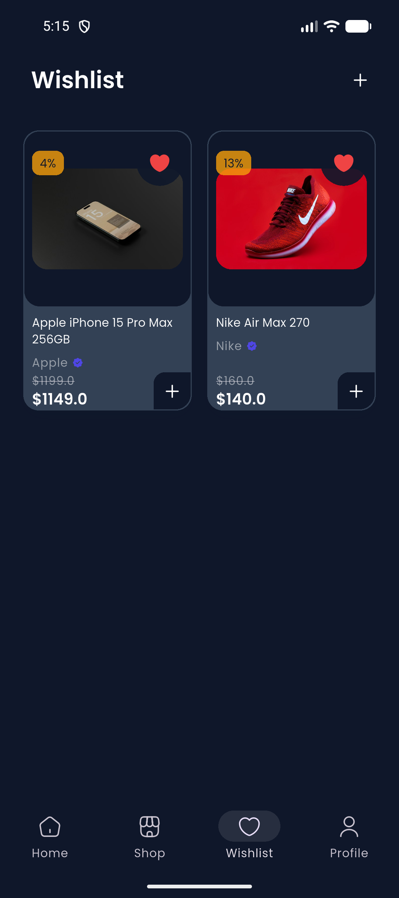 | 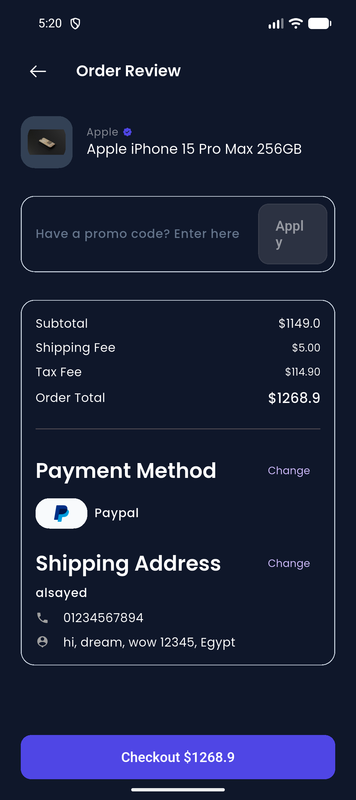 | 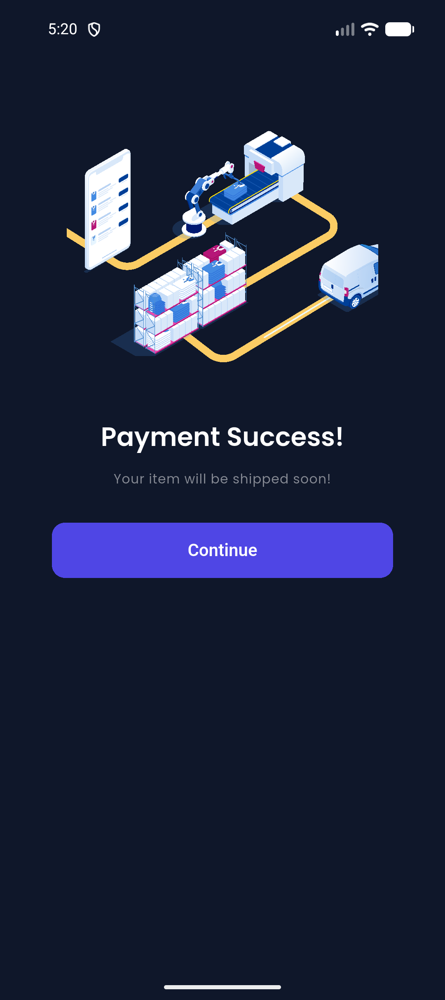 |

---

### 4. Brands & Profile Management
| All Official Brands | Brand Products (Apple) | User Account & Settings |
| :---: | :---: | :---: |
| 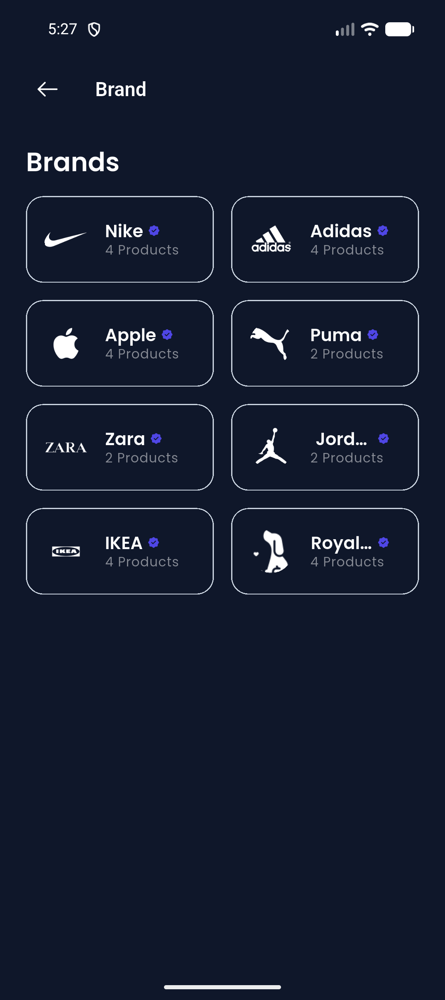 | 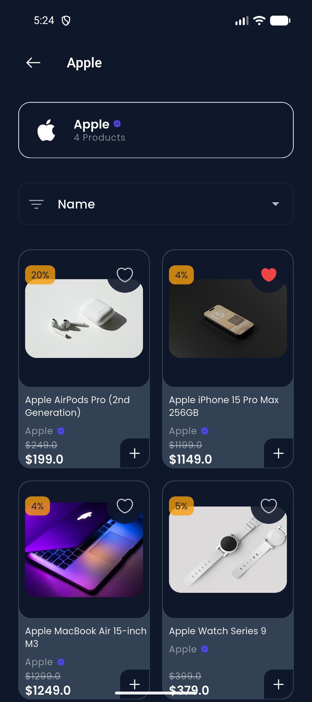 | 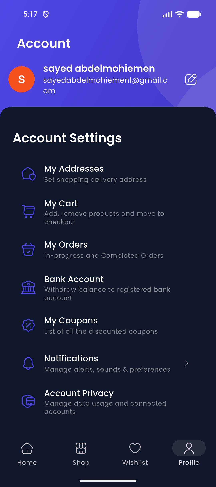 |

---

## ✨ Core Features

- 🔐 **Authentication & Security:** Email/Password authentication, sign-up with validations, password reset, and secure persistent sessions via Supabase Auth.
- 🎨 **Unified Design System:** Deep indigo & slate theme (`#4F46E5`), smooth rounded corners (16px), micro-animations, and consistent dark/light themes.
- 🏪 **Store & Categories:** Dynamic category tabs with auto-linked subcategories, brand showcases, and featured products.
- 🏷️ **Brand Hub:** Official verified brands (Nike, Adidas, Apple, Puma, etc.) with real-time product counts and brand filtering.
- 🔎 **Instant Search:** Quick filter chips, debounce search querying, and instant results display.
- ❤️ **Wishlist:** Real-time favorite synchronization saved to local/cloud storage.
- 🛒 **Cart & Checkout:** Variable product support, promo coupon application, order summary calculations, and payment completion flows.
- 👤 **Account Management:** User profile, addresses, order history, and streamlined notification settings.

---

## 🏗️ Project Architecture

```
lib/
├── common/             # Reusable UI widgets, styles, headers, cards & layouts
├── data/               # Repositories & Cloud Services (Supabase integrations)
│   ├── repositories/   # Abstracted business repositories (Auth, Products, Brands, etc.)
│   └── services/       # Specialized service classes (Queries, Favorites, Caching)
├── features/           # Feature-driven modular structure
│   ├── authentication/ # Onboarding, Login, Register, Forgot Password
│   ├── personalization/# Profile, User Address, App Settings
│   └── shop/           # Home, Store, Cart, Checkout, Wishlist, Product Details
└── utils/              # Helpers, constants, formatters, exceptions, themes
    └── constants/
        ├── app_env.dart         # Local environment keys (gitignored for security)
        └── app_env.example.dart # Safe credential template for developers
```

---

## 🚀 Getting Started & Setup

### Prerequisites
- [Flutter SDK](https://docs.flutter.dev/get-started/install) (`>=3.3.0`)
- [Dart SDK](https://dart.dev/get-dart) (`>=3.0.0`)
- A [Supabase](https://supabase.com) project

### Installation

1. **Clone the repository:**
   ```bash
   git clone https://github.com/your-username/S_Store.git
   cd S_Store
   ```

2. **Install dependencies:**
   ```bash
   flutter pub get
   ```

3. **Configure Environment Credentials (Security):**
   - Copy the example environment file:
     ```bash
     cp lib/utils/constants/app_env.example.dart lib/utils/constants/app_env.dart
     ```
   - Open `lib/utils/constants/app_env.dart` and enter your Supabase URL and Publishable/Anon Key:
     ```dart
     class SAppEnv {
       static const String supabaseUrl = 'https://YOUR_PROJECT_ID.supabase.co';
       static const String supabasePublishableKey = 'YOUR_SUPABASE_ANON_KEY';
     }
     ```

4. **Run the App:**
   ```bash
   # Run on connected emulator or device
   flutter run
   ```

---

## 🔒 Security Best Practices

- All backend URLs, API keys, and sensitive tokens are strictly isolated in `app_env.dart` and excluded via `.gitignore`.
- Row-Level Security (RLS) policies are active on backend database tables.
- Authentication tokens are handled via secure native storage mechanisms.

---

## 📄 License
This project is licensed under the MIT License — see the [LICENSE](LICENSE) file for details.
